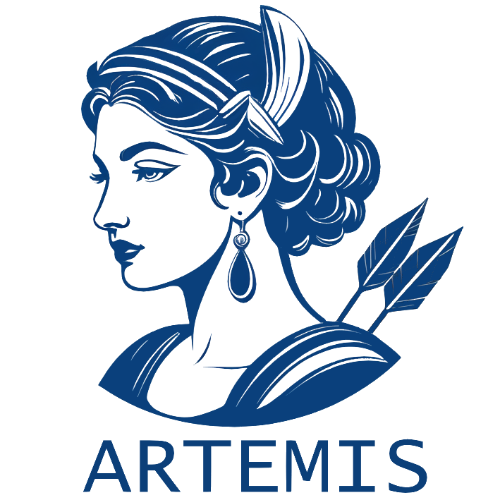

<p float="left">



</p>

## Overview

ARTEMIS provides an interface to a modified Temporal Smith–Waterman (TSW) algorithm, adapted from the approach presented in [10.1109/DSAA.2015.7344785](https://www.researchgate.net/publication/292331949_Temporal_Needleman-Wunsch). This algorithm transforms longitudinal EHR data into discrete regimen eras.
Although applicable to various contexts, ARTEMIS is primarily intended for cancer patients and uses regimen definitions sourced from the [`HemOnc`](https://hemonc.org/wiki/Main_Page) oncology reference.


<figure>

<figcaption aria-hidden="true">ARTEMIS Workflow</figcaption>
</figure>

### Quick to Docs:
* See [release notes](docs/branch-versioning.md) for versioning and contribution.

## Running the study with Docker

For participating data partners, the recommended way to run the study is the
pre-built Docker image. It bundles ARTEMIS, all R and Python dependencies, the
JDBC drivers, and RStudio Server, so no manual installation is required.

The registry is the DARWIN EU® Azure Container Registry (ACR):

```
Login server : onconet-thg9fxc7hxgvc6ga.azurecr.io
Image        : onconet-thg9fxc7hxgvc6ga.azurecr.io/artemis
```

Pick **one** of the three options below to obtain the image.

### Option A — Pull from Azure Container Registry (recommended)

You need access to the `onconet` registry, granted by the coordinating center
(DTZ). Images are published **per architecture** with an `-amd64` or `-arm64`
tag suffix — choose the one matching your host (most servers are `amd64`; Apple
Silicon Macs are `arm64`).

With the [Azure CLI](https://learn.microsoft.com/cli/azure/) installed:

```bash
az login
az acr login --name onconet
docker pull onconet-thg9fxc7hxgvc6ga.azurecr.io/artemis:latest-amd64
# or a specific release, e.g. :v1.6.0-amd64   (use the -arm64 tags on arm64 hosts)
```

If DTZ instead provides a registry username/token, you can log in to the
registry directly without the Azure CLI:

```bash
docker login onconet-thg9fxc7hxgvc6ga.azurecr.io
docker pull onconet-thg9fxc7hxgvc6ga.azurecr.io/artemis:<tag>-amd64
```

### Option B — Build the image from source

The private dependency `P4C5006` is installed during the build, so you must
supply a GitHub Personal Access Token (with read access to that repo) as a
BuildKit secret:

```bash
git clone https://github.com/darwin-eu-dev/ARTEMIS
cd ARTEMIS

DOCKER_BUILDKIT=1 GITHUB_PAT=<your_github_pat> \
  docker build \
    --secret id=github_pat,env=GITHUB_PAT \
    -t artemis:local \
    .
```

### Option C — Transfer to an air-gapped / offline machine (save & load)

On a machine **with** internet access, pull (Option A) or build (Option B) the
image, then export it to a tar archive:

```bash
docker save onconet-thg9fxc7hxgvc6ga.azurecr.io/artemis:<tag>-amd64 -o artemis_<tag>-amd64.tar
# optional: gzip artemis_<tag>-amd64.tar
```

Copy the `.tar` (or `.tar.gz`) to the offline machine and import it:

```bash
docker load -i artemis_<tag>.tar
```

### Running the container

The image serves RStudio Server on port 8787. JDBC drivers are already baked
into the image (`/opt/hades/jdbc_drivers`), so a database connection works out
of the box. Mount a host folder to the results directory so outputs persist
after the container stops:

```bash
docker run --rm -it \
  -p 8787:8787 \
  -e PASSWORD=<choose_a_password> \
  -v "$(pwd)/Results:/home/rstudio/ARTEMIS/Results" \
  onconet-thg9fxc7hxgvc6ga.azurecr.io/artemis:<tag>-amd64
```

Open <http://localhost:8787> and log in as user `rstudio` with the password you
set. In RStudio, edit your database connection details and run the study, for
example:

```r
library(ARTEMIS)

cdm <- CDMConnector::cdmFromCon(
  con,                       # your DBI/DatabaseConnector connection
  cdmSchema   = cdmSchema,
  writeSchema = writeSchema
)

runArtemis(
  cdm,
  outputFolder         = "Results",
  cancers              = c("breast_cancer", "lung_cancer"),
  generateReportOutput = TRUE
)
```

`extras/codeToRun.R` is a complete, editable template for this step. All
results are written to the mounted `Results/` folder (see
[Reviewing results](#reviewing-results-and-returning-them-to-dtz) below).

## Installation

Before installing ARTEMIS, ensure that **Python (version ≥ 3.12)** is installed on your system.  
You can check which Python version R detects using:

```r
system("python --version", intern = TRUE)
```

If you want ARTEMIS to use a specific Python interpreter, set the `ARTEMIS_PYTHON` environment variable before installation:

```r
Sys.setenv(ARTEMIS_PYTHON = "/path/to/your/python")
```

ARTEMIS can be installed directly from GitHub:

```r
# Install devtools if it is not already installed
if (!requireNamespace("devtools", quietly = TRUE)) {
  install.packages("devtools")
}

# Install ARTEMIS from GitHub
devtools::install_github("OHDSI/ARTEMIS")
```

If you are unsure how to install `Python` or set `ARTEMIS_PYTHON`, refer to the OS-specific setup instructions below.

### On Windows
Install Python 3.12 or above from the Microsoft Store or from:
https://www.python.org/downloads/windows/

Then open cmd or PowerShell and set the environment variable:

    set ARTEMIS_PYTHON=<ABS\\PATH\\TO\\python.exe (v3.12+)>

Other requirements checklist:

* R, Rtools, and devtools installed

* Microsoft Visual C++ 14.0 or greater (required by Python packages like numpy)

* Visual Studio Build Tools (for faster Cython-compiled alignment)

### On Linux or macOS

Install Python 3.12+ using your preferred package manager (e.g., Homebrew, apt, pacman) or download it from: https://www.python.org/

Then from the terminal, set the Python version environment variable:

    export ARTEMIS_PYTHON="/absolute/path/to/python3.12"

Other dependencies you might need installed:

    base-devel, r, git, libgit2, zlib, libxml2, openssl, curl, pkgconf, 
    pandoc, glpk, gmp, libtool, graphviz, make, cmake, tzdata, 
    jdk-openjdk, libcurl-compat, gcc-fortran, openblas, lapack

### Reticulate

💡 You do NOT need to manually set up reticulate — ARTEMIS takes care of it automatically during setup. This section is for informational purposes only.

ARTEMIS relies on a python back-end via
[reticulate](https://rstudio.github.io/reticulate/) and depending on
your reticulate settings, system and environment, you may need to run
the following commands before loading the package:

    reticulate::py_install("numpy")
    reticulate::py_install("pandas")

    **Other python dependencies for the build**
    reticulate::py_install("setuptools")
    reticulate::py_install("wheel")
    reticulate::py_install("Cython")
    reticulate::py_install("tqdm")
    
If you do not presently have reticulate or python3.12 installed you may
first need to run the following commands to ensure that reticulate can
access a valid python install on your system:

    install.packages("reticulate")
    library(reticulate)

This will prompt reticulate to install python, create a local virtualenv
called “r-reticulate” and, finally, set this virtual environment as the
local environment for use when running python via R through reticulate.

## Usage - User Script

A user script is included in this repository,`userScript.R`, to demonstrate how ARTEMIS works. It uses a dummy database to create patients and align them with treatment regimens. During regimen selection, predefined concept filtering (e.g., antibiotics, steroids) is applied by default. The user can override these defaults by setting ignore_default_list, but must provide the concept file path as an argument. The concept file should contain one concept ID per line. The reference concept table is bundled with the package and can be inspected with `data("regimens", package = "ARTEMIS"); head(concepts)`.


### DatabaseConnector

ARTEMIS also relies on the package
[DatabaseConnector](https://github.com/OHDSI/DatabaseConnector) to
create a connection to your CDM. The process of cohort creation requires
that you have a valid data-containing schema, and a pre-existing schema
where you have write access. This write schema will be used to store
cohort tables during their generation, and may be safely deleted after
running the package.

The specific drivers required by dbConnect may change depending on your
system. More detailed information can be found in the section “DBI
Drivers” at the bottom of this readme.

If the OHDSI package [CirceR](https://github.com/OHDSI/CirceR) is not
already installed on your system, you may need to directly install this
from the OHDSI/CirceR github page, as this is a non-CRAN dependency
required by CDMConnector. You may similarly need to install the
[CohortGenerator](https://github.com/OHDSI/CohortGenerator) package
directly from GitHub.

    #devtools::install_github("OHDSI/CohortGenerator")
    #devtools::install_github("OHDSI/CirceR")

    connectionDetails <- DatabaseConnector::createConnectionDetails(dbms="redshift",
                                                                    server="myServer/serverName",
                                                                    user="user",
                                                                    port = "1337",
                                                                    password="passowrd",
                                                                    pathToDriver = "path/to/JDBC_drivers/")

    cdmSchema <- "schema_containing_data"
    writeSchema <- "schema_with_write_access"

### Input

An input JSON containing a cohort specification is input by the user.
Information on OHDSI cohort creation and best practices can be found
[here](https://ohdsi.github.io/TheBookOfOhdsi/Cohorts.html). An example
cohort selecting for patients with NSCLC is provided with the package.

    df_json <- loadCohort()
    json <- df_json$json[1]
    name <- "examplecohort"

    #Manual
    #json <- CDMConnector::readCohortSet(path = here::here("myCohort/"))
    #name <- "customcohort"

Regimen data may be read in from the provided package, or may be
submitted directly by the user. All of the provided regimens will be
tested against all patients within a given cohort.

    regimens <- loadRegimens(condition = "all")
    regGroups <- loadGroups()

    #Manual
    #regimens <- read.csv("/path/to/my/regimens.csv")

A set of valid drugs may also be read in using the provided data, or may
be curated and submitted by the user. Only valid drugs will appear in
processed patient strings, and thus any drugs not included here will not
effect alignment. Drugs which are frequently taken outside of
chemotherapy regimens, such as antiemetics, should not be added to this
list.

    validDrugs <- loadDrugs()

    #Manual
    #validDrugs <- read.csv(here::here("data/myDrugs.csv"))

### Pipeline

The cdm connection is used to generate a dataframe containing the
relevant patient details for constructing regimen strings.

    con_df <- getConDF(connectionDetails = connectionDetails, 
                       json = json, 
                       name = name, 
                       cdmSchema = cdmSchema, 
                       writeSchema = writeSchema)

Regimen strings are then constructed, collated and filtered into a
stringDF dataframe containing all patients of interest.

    stringDF <- stringDF_from_cdm(con_df = con_df, validDrugs = validdrugs)

The TSW algorithm is then run using user input settings and the provided
regimen and patient data. Detailed information on user inputs, such as
the gap penalty, g, can be found [here](www.github.com/OHDIS/ARTEMIS).

    output_all <- stringDF %>% 
        generateRawAlignments(
            regimens = regimens,
            g = 0.4,
            Tfac = 0.5,
            verbose = 0,
            mem = -1,
            method = "PropDiff"
        )

Raw output alignments are then post-processed.
Post-processing steps include the handling of
overlapping regimen alignments, as well as formatting output for
submission to an episode era table.

    processedAll <- output_all %>% 
            processAlignments(regimenCombine = 28, regimens = regimens)

Treatment trajectories, or regimen eras, can then be calculated, adding
further information about the relative sequencing order of different
regimens and regimen types.

    pa <- processedAll %>% 
            calculateEras(discontinuationTime = 90)


Individual patient regimens can be visualized using `plotAlignment`.

```
p <- plotAlignment(pa)
p
```

<figure>

<figcaption aria-hidden="true">Visualization of Aligned Regimens</figcaption>
</figure>


Data may then be further explored via several graphics which indicate
various information, such as regimen frequency or the score/length
distributions of a given regimen.

    plotFrequency(pa)
    plotScoreDistribution(pa)
    plotRegimenLengthDistribution(pa)

These functions display the most frequent regimens, but additional regimens can also be specified.

    plotScoreDistribution(pa, components = c("Pembrolizumab monotherapy"))
    plotRegimenLengthDistribution(pa, components = c("Pembrolizumab monotherapy"))


Finally, basic statistics is providedy by: 

    regStats <- processedEras %>% g
            enerateRegimenStats()


## Reviewing results and returning them to DTZ

`runArtemis()` writes everything to the `outputFolder` (default `Results/`).
After a run, that folder contains:

| File | Level | Description |
| ---- | ----- | ----------- |
| `log.txt` | metadata | Full run log: every step plus per-cohort person and record counts. |
| `cdm_snapshot.csv` | metadata | CDM snapshot (source name, vocabulary version, etc.). |
| `stats.rds` | aggregated | Per-cohort regimen statistics (counts, frequencies, score/length summaries). |
| `artemis_report.html` | mixed | Summary report (only if `generateReportOutput = TRUE`). Includes a few **example patient timelines**. |
| `con_dfs.rds` | patient-level | Per-cohort patient drug-exposure records. |
| `stringDFs.rds` | patient-level | Per-cohort encoded patient drug-record strings. |
| `outputs.rds` | patient-level | Raw per-patient regimen alignments. |
| `processed.rds` | patient-level | Post-processed per-patient regimen alignments. |
| `eras.rds` | patient-level | Per-patient treatment eras / lines of treatment. |

### Reviewing

1. Open `artemis_report.html` in a browser for the summary.
2. Read `log.txt` to confirm each step completed and to check the cohort person
   and record counts are sensible for your database.
3. Inspect `stats.rds` in R (`readRDS("Results/stats.rds")`) for the aggregated
   regimen statistics.

### What to return to the coordinating center (DTZ)

> ⚠️ **Always run a disclosure review against your local data-governance rules
> and the study protocol before sharing anything.** The exact deliverable list
> is defined by the study protocol — confirm with DTZ if in doubt.

Default guidance:

- **Return** the aggregated and metadata files after review:
  `stats.rds`, `log.txt`, `cdm_snapshot.csv`, and (if generated)
  `artemis_report.html`.
- Apply your site's **minimum cell count** suppression to `stats.rds` (the
  `count`/`frequency` columns) and to the report before sharing.
- The `artemis_report.html` embeds a small number of **example patient drug
  timelines** — review it specifically for disclosure, or regenerate the report
  with `reportExamples = 0` if example timelines are not permitted.
- **Do not return** the patient-level files (`con_dfs.rds`, `stringDFs.rds`,
  `outputs.rds`, `processed.rds`, `eras.rds`) unless the protocol and your data
  governance explicitly allow row-level data to leave your environment. They are
  kept locally to support debugging and re-analysis.

## Getting help

If you encounter a clear bug, please file an issue with a minimal
[reproducible example](https://reprex.tidyverse.org/) at the [GitHub
issues page](https://github.com/OHDSI/ARTEMIS/issues).
